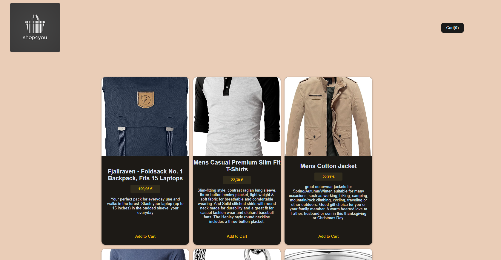

# Store-app

Web app which represents an online store. It uses FakeStore API to fetch data and show dummy products. 
You can add items to cart, edit the cart and proceed to checkout.

* project showcase

## Requirements

* Node v16.7.0
* npm v7.20.3

## How to install

* This project uses Vite for bundling, frontend is made with React. Other dependencies will be installed as well. 

1. clone this project
2. cd into "Store-app" folder and run `npm install`. This will install npm and all the frontend dependencies.
3. Run - `npm run dev` to run the developer server, this will open the app in the browser.
